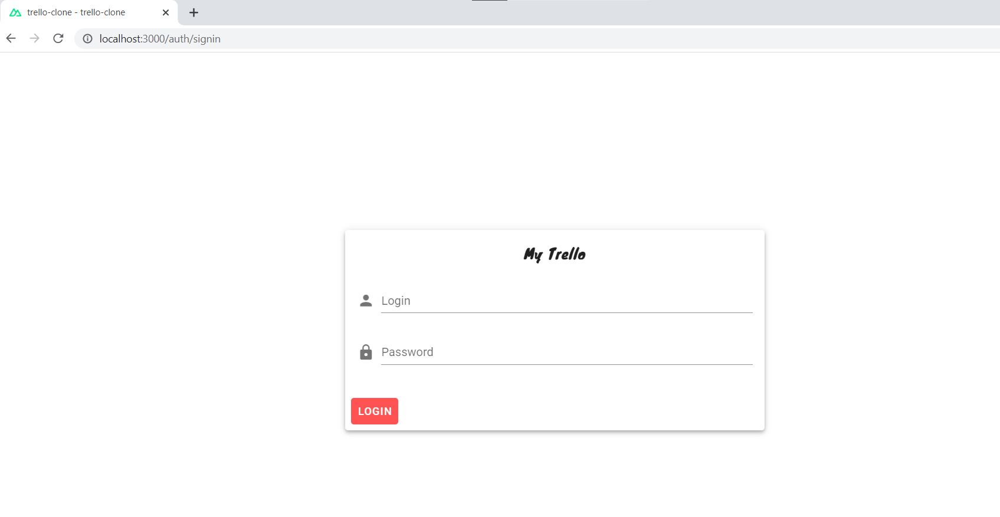
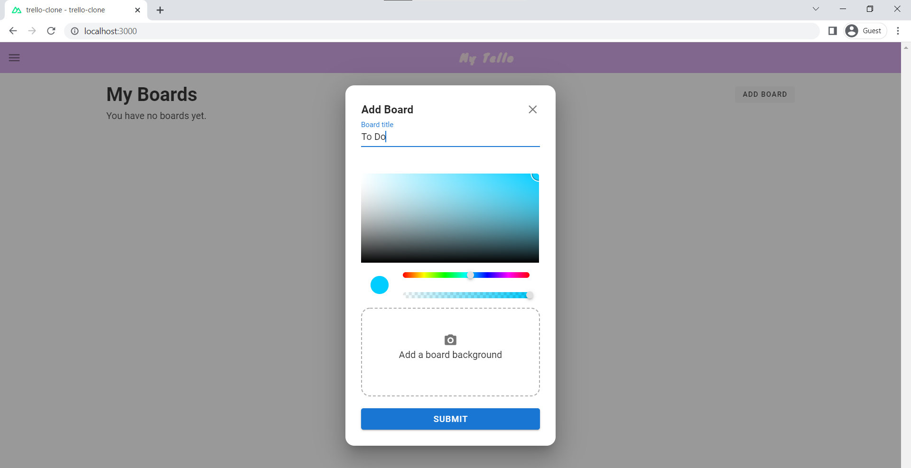
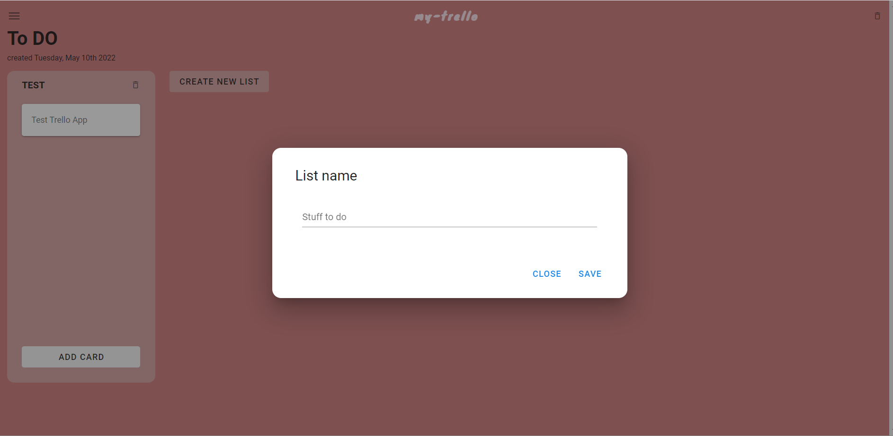

# trello-clone

A trello clone using Nuxt.js and Vuetify

## Build Setup







## Table of Contents

1. [Install](#install)
2. [Contributing](#contributing)
3. [Contact](#contact)

## Install
```bash
# 1. Clone (or [fork](https://help.github.com/articles/fork-a-repo/)) this repository:

$ git clone https://github.com/Ines-Bouguerra/trello-clone.git.git

# 2. Change directory into the cloned repository: 

$ cd trello-clone

# 3. Install the dependencies: 

        # install dependencies
        $ yarn install

        #copy .env.example to .env
        $ cp .env.example .env

        # edit .env file
        $ nano .env
        
        # serve with hot reload at localhost:3000
        $ yarn dev

# 4. build for production and launch server

        - If you want to build and launch the production app you can run 
        
                $ yarn build

        - This will give you an executable inside the `/dist` folder.

                # generate static project
                $ yarn generate
```
### Docker
```bash	
docker compose up -d
``` 
## Contributing
We :heart: contributions from everyone and contributions to this project are encouraged, and compensated. We welcome [bug reports](https://github.com/Ines-Bouguerra/trello-clone/issues/), [bug fixes](https://github.com/Ines-Bouguerra/trello-clone/pulls) and feedback is always appreciated. For more details, see [CONTRIBUTING.md](CONTRIBUTING.md).

## [](https://github.com/Ines-Bouguerra/trello-clone/issues)[](https://github.com/Ines-Bouguerra/trello-clone/graphs/contributors/)
## Contact

The primary contact for this project is [@ines](https://github.com/Ines-Bouguerra).